# **Engineering Drawing Basics : AutoCAD Remote Design**

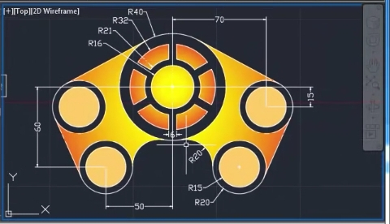

In this tutorial we will be trying to design a video game remote using
AutoCAD 2D Software. The tutorial is up from scratch, so don't be afraid
if you do not know AutoCAD intermediate. This was a part of my
submission for First year Electrical Engineering Drawing/Design
Competition.

### **P.S. -** Please ignore any trivial mistakes as I was a beginner back
then. Cheers XD :)

### **Autocad Shortcuts** :
[[thesourcecad.com/autocad-commands/]{.underline}](https://www.thesourcecad.com/autocad-commands/)

## **Happy Learning Computer Aided Design !**

LIMITS

Specify lower left corner : (0,0)

Speecify upper right corner : (1000,1000)

CIRCLE

Specify centre: (200,200)

Specify radius: 16

CIRCLE

Specify centre: (200,200)

Specify radius: 21

CIRCLE

Specify centre: (200,200)

Specify radius: 32

CIRCLE

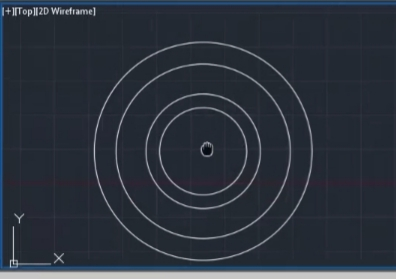

Figure 0

Specify centre: (200,200)

Specify radius: 40

The resulting figure should look like this :

Figure 1

LINE

Specify first point: (200, 216)

Specify next point:(200, 240)

MOVE

Select objects

Select base point or [D]{.underline}isplacement: D \[Enter\] 3

COPY

Select object(s) and drag the cursor to right entering 6

Specify second point or \[[A]{.underline}rray\]: 6

The resulting figure would look like this :

Figure 2

TRIM

Select objects or \<select all\>

//Right click on screen \[Fence/Crossing, Project, eRase, Undo\] specify
opposite corner: specify opposite corner: Use cursor to remove the
unnecessary parts as shown in the figure\...
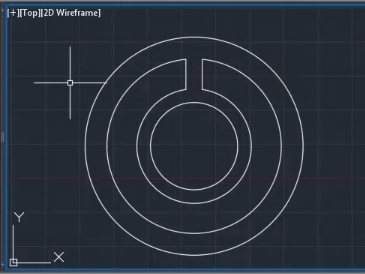

Figure 3

Proceed to rub out the other sections as follows :

Figure 4

ARRAY

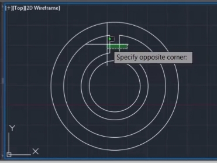

Select objects: Select the two straight lines in figure 5. As shown
below in the figure :

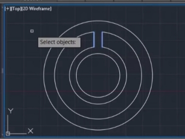

Figure 5

Figure 6

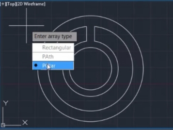

Enter Array type: Polar(PO)

Figure 7

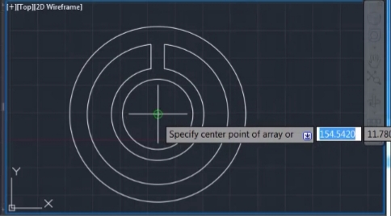

Specify center point of array or\[ [B]{.underline}ase Point
[A]{.underline}xis of Rotation\] : (200,200)

Figure 8

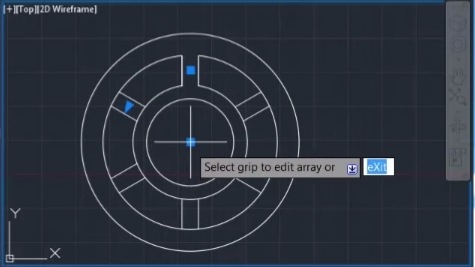

The figure after this action will look like :

Figure 9

Select grip to edit array or \[ASscociative Base Point Items Angle
between Fill angle Rows Levels Rotate items eXit\] \<eXit\> : choose to
exit.

TRIM

Select objects or \<select all\>

//Right click on screen

\[Fence/Crossing, Project, eRase, Undo\] specify opposite corner:
specify opposite corner:

Remove the unnecessary lines as shown in Figure 10 using the cursor :

Figure 10

The resulting final figure should look like this :

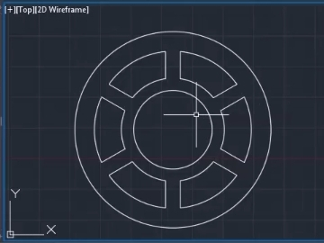

Figure 11

We have successfully created the central buttons.

No we will create the other buttons.

CIRCLE

Specify centre: (270,185)

Specify radius: 20

CIRCLE

Specify centre: (270,185)

Specify radius: 15

CIRCLE

Specify centre: (250, 140)

Specify radius: 20

CIRCLE

Specify centre: (250,140)

Specify radius: 15

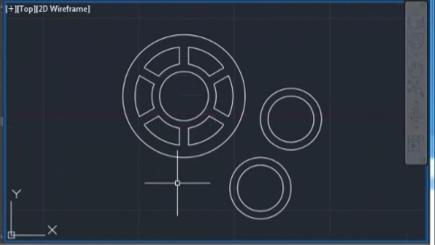

Resulting figure with 2 more buttons

Figure 12

Now we use a shortcut technique used for quick symmetrical drawings,

the MIRROR Command,to get the two more buttons on the left of the
central buttons\...

MIRROR

Select objects: Specify opposite corners:

Select the two extra buttons that we just added using the cursor as
shown in the following
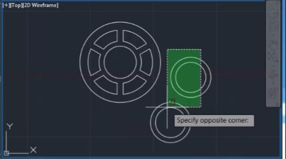

Figure 13

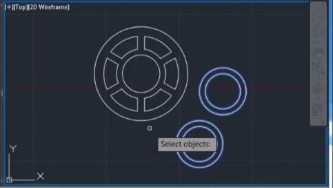

The selection looks like the following :

Figure 14

Specify first point of mirror line: (200,200)

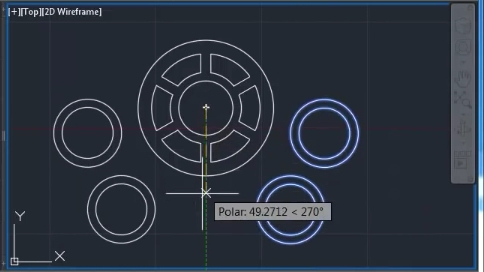

Specify second point of mirror line: (200,140)

Figure 15

Erase source objects? Yes No \<No\> : Select No.

We have successfully created a mirror image now.

Circle :

Specify centre point for circle or : ttr (ta, tan, radius)

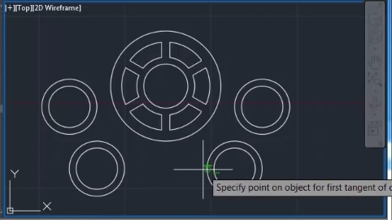

Specify point on object for first tangent of circle :Select point as
shown in the figure :

Figure 16

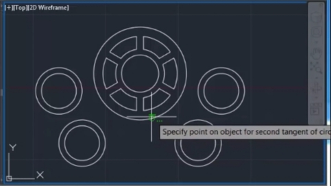

Specify point on object for second tangent of circle :Select point as
shown in the figure :

Figure 17

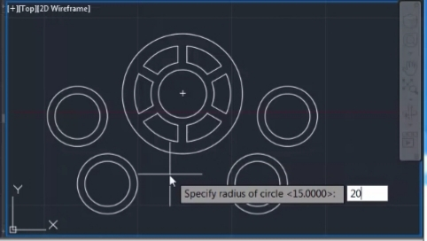

Specify radius of circle \<15.000\> : 20

Figure 18

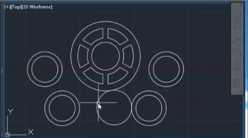

The final drawing should look like this :

Figure 19

Now we will use the mirror command again to replicate the same circle to
the left

MIRROR

Select objects: Specify opposite corner : Select as shown in the two
figures..

Figure 20

Figure 21

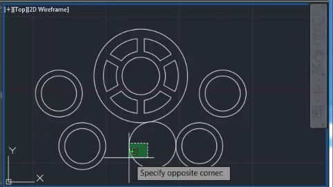

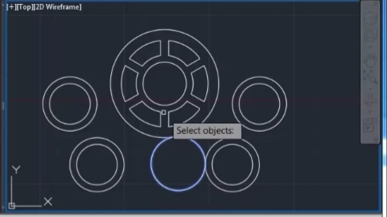

Specify first point of mirror line : (200,200)

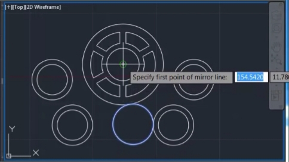

Specify second point of mirror line : As shown

Figure 22

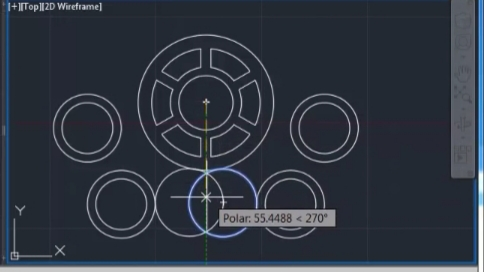

Figure 23

Erase source object? \[Yes No\] \<No\> :Select No.

Resulting drawing :

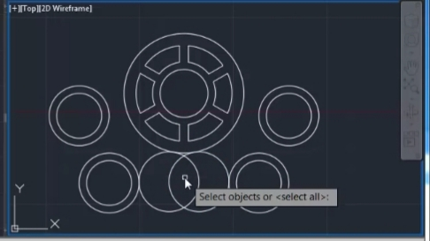

Figure 24

TRIM

\[Fence/Crossing, Project, eRase, Undo\] specify opposite corner:
specify opposite corner:

Remove the unnecessary lines as shown in Figure 25 using the cursor :

Select the object :

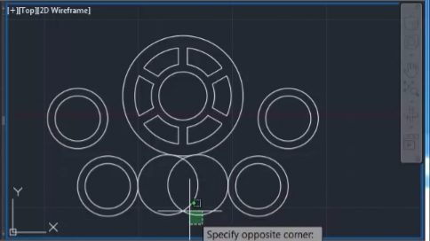

Figure 25

Also skillfully remove the small areas of the circles touching each
other

.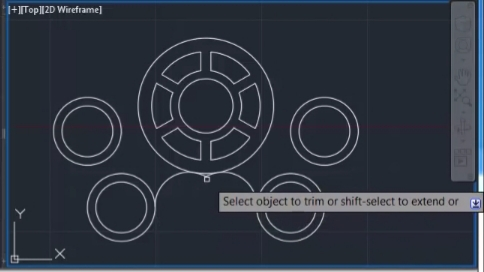

Figure 26

The resulting drawing is :

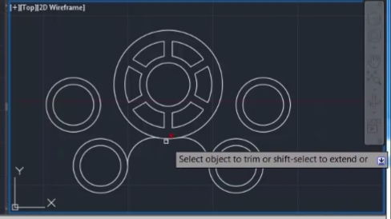

Figure 27

Now type DS in the command prompt to get the drafting settings dialog
box. Click on object snap bar and under object snap modes you will
observe that initially all of the options are available.

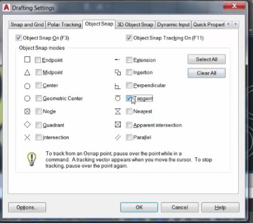

Deselect every option and select only tangent and then click OK.

Figure 28

LINE

Specify first point:

Specify next point :

Now use the line command and draw tangents at each of the peripheries of
the outermost circles as shown stepwise in the following figures..

Figure 29 Step 1

Figure 30 Step 2

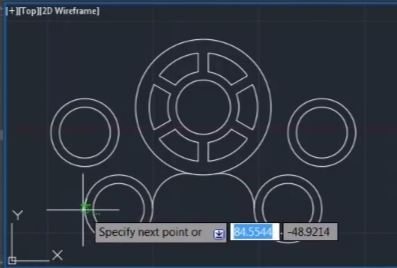

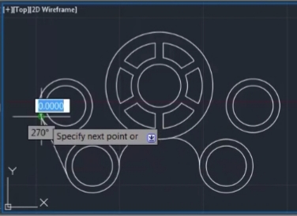

Figure 31 Step 3

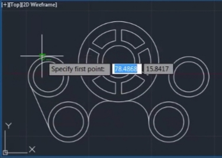

Figure 32 Step 4

Figure 33 Step 5

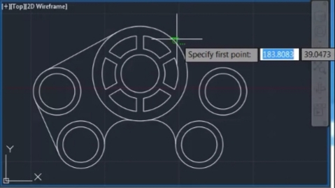

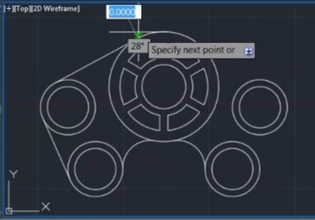

Figure 34 Step 5

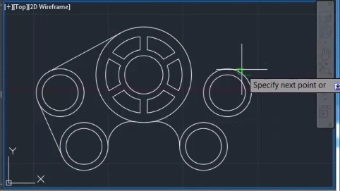

Figure 35 Step 6

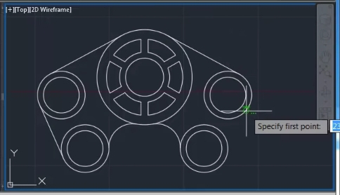

Figure 36 Step 7

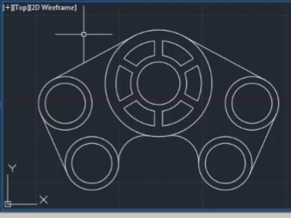

Figure 37 Step 8

The drawing is practically complete but needs some colour into it\...

Hence we use the hatch command.

HATCH

The cursor asks for an internal point input

To change colour and various attributes we use the hatch propertes
toolbar

We change the pattern to gradient

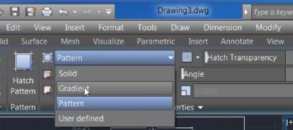

Figure 38

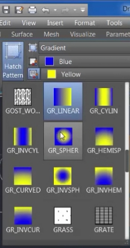

We then change the hatch pattern from GR\_LINEAR to GR\_SPHERICAL.

Figure 39

Figure 40

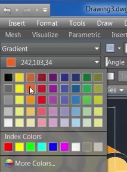

We also change the colour from Blue to Orange (GRB values 242,103,34)

Also we change the last four buttons colour to Yellow-Orange
(GRB-254,204,102)

We pick the various internal points in the drawing and this is what is
the outcome :

Figure 41

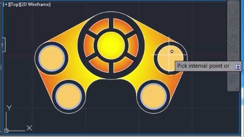

Figure 42

We then use the DIMSTY to open the dimension style manager dialog box.

Click on modify button.

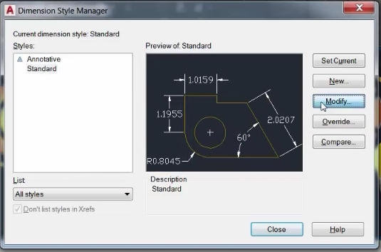

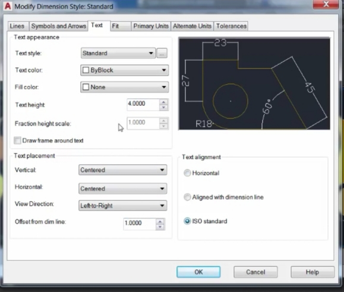

Figure 43

Select Text.

Set the values according to your choice (as shown in the figure. )

Open symbols and arrows tab and do the same for lines tab also.

Figure 45

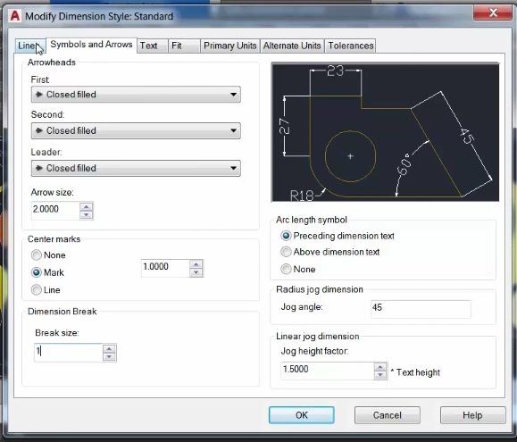

Figure 44

Figure 45

Close the dimensions style manager.

Open the Drafting settings dialog box by using DS command.

Under object snap reselect all the checkboxes by using select all and
then click OK.

DIMLIN (DIMLINEAR)

Give linear dimensions as specified in the figure.

DIMRAD (DIMRADIUS)

Give radial dimensions as specified in the figure.

Your drawing is now complete.

Figure 46
